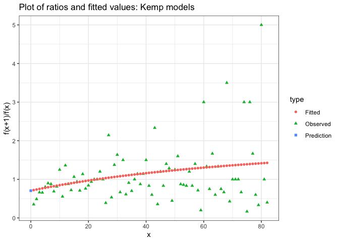
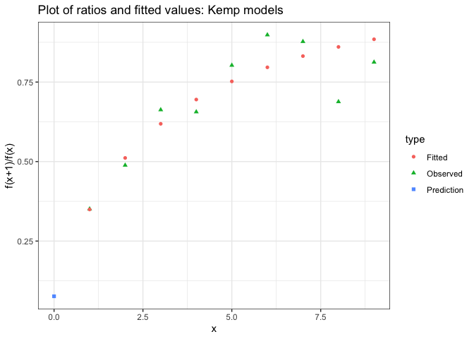

Introduction to diversity estimation
================
Amy Willis
2022-02-28

`breakaway` is a package for estimating species richness. This vignette
will lead you through how species richness estimation works, how to get
an estimate of species richness using `breakaway`.

We will also talk about diagnosing and fixing model misspecification.

## Preliminaries

Download the latest version of the package from github.

``` r
library(breakaway)
```

Note that we are not continuing to maintain the CRAN version of
`breakaway` at this time, so avoid `install.packages("breakaway")`.

If you are not accustomed to using the pipe in `R` (the operator `%>%`),
I strongly encourage you to start using it. It will make your code
easier to read and write. Here is how to install and load it:

``` r
library(magrittr)
```

    ## Warning: package 'magrittr' was built under R version 4.0.5

## Why bother with species richness estimation?

Typically, when you sample species (or groups) from a population, you
won’t see every *individual* in the population. This means that you may
not see every *species* in the population. The species richness that you
observed in your sample will generally be lower than the species
richness in your population.

The best way to correct this issue is to estimate the number of species
that are present in your population but missing from the sample.
`breakaway` provides software to do this.

Sometimes modeling observed richness is fine and doesn’t cause a problem
for modeling or inference. However, *especially* when some populations
are sampled more intensively than others (e.g., your sequencing depth is
higher in some samples than others), samples should not be directly
compared without adjustment. We recommend getting into the habit of
estimating the number of missing species before making conclusions about
diversity.

Note that while this problem has been called “species richness” for
historical reasons, you can also estimate the richness at the level of
strain (or sub-species), genus, family, etc. The input data that you
provide determines the taxonomic order on which `breakaway` estimates
the richness. Therefore, if you would like to estimate strain richness,
simply give `breakaway` abundance data at the strain level. `phyloseq`
has a nice function called `tax_glom()` that can help with this.

## How does species richness estimation work?

Species richness estimates use the structure of the data that you
observed to predict how many species were missing. Essentially, if there
are only a few species in the sample that were observed rarely, that
suggests that you probably observed most of the diversity in the
community. In this case, the total species richness estimate would be
close to the observed species richness. Alternatively, if there were
many species in the sample that were observed infrequently (such as once
or twice), this suggests that there were many species that were observed
zero times. In this case, the species richness estimate would be larger
than the observed species richness. `breakaway` uses statistical models
to determine how much larger it should be.

## Estimating the diversity of human host associated microbes

In their very cool paper “Extensive Unexplored Human Microbiome
Diversity Revealed by Over 150,000 Genomes from Metagenomes Spanning
Age, Geography, and Lifestyle”
([doi.org/10.1016/j.cell.2019.01.001](https://doi.org/10.1016/j.cell.2019.01.001)),
Pasolli and co-authors assembled 4,930 species-level genome bins using
publicly available shotgun metagenomic data. Our goal is to estimate the
species-level diversity of human host associated microbes.

First, let’s read in the data:

``` r
pasolli_et_al <- openxlsx::read.xlsx("https://ars.els-cdn.com/content/image/1-s2.0-S0092867419300017-mmc4.xlsx", sheet = 2)
```

The “frequency count table” is the basic data structure for estimating
species richness. It is a table with two columns: the second column
indicates the number of species observed `j` times, where the first
column contains `j`. Let’s take a look at the first 10 columns of the
frequency count table for the Pasolli et al dataset:

``` r
ft <- pasolli_et_al$`#.Samples` %>% make_frequency_count_table
ft %>% head(10)
```

    ##    Var1 Freq
    ## 1     1 1972
    ## 2     2  692
    ## 3     3  338
    ## 4     4  224
    ## 5     5  147
    ## 6     6  118
    ## 7     7  106
    ## 8     8   93
    ## 9     9   64
    ## 10   10   52

So 1972 species were observed once, 692 were observed twice, and 52 were
observed ten times.

``` r
ft %>% tail(10)
```

    ##     Var1 Freq
    ## 298 1584    1
    ## 299 1629    1
    ## 300 1805    1
    ## 301 1811    1
    ## 302 1844    1
    ## 303 1925    1
    ## 304 2169    1
    ## 305 2559    1
    ## 306 2983    1
    ## 307 3453    1

The common species are at the other end of the frequency count table:
the most common species was observed 3453 times. There was only
`ft[nrow(ft), 2]` species observed 3453 times.

Let’s take a look to see how many species were observed in the dataset:

``` r
ft %>% sample_richness
```

    ## Estimate of richness from method Plug-in:
    ##   Estimate is 4930
    ##  with standard error 0
    ##   Confidence interval: (4930, 4930)

Cool! We corroborated the abstract of the paper and saw that 4930
species level genome bins were identified.

If you’re not accustomed to using `%>%`, here is a quick demo:
`argument %>% function`. It’s equivalent to executing
`function(argument)`. So essentially we just ran `sample_richness(ft)`,
but we stated the argument first. The pipe operator `%>%` becomes
especially useful when you want to compound multiple functions.
[Here](https://www.datacamp.com/community/tutorials/pipe-r-tutorial) is
a great introduction, and
[here](https://github.com/adw96/biostat561/blob/master/lecture2/lecture2.pdf)
is a lecture I gave to our department’s PhD students about it.

## Species richness estimation with `breakaway`

The simplest way to estimate species richness with `breakaway` is as
follows:

``` r
estimated_richness <- breakaway(ft)
estimated_richness
```

    ## Estimate of richness from method breakaway:
    ##   Estimate is 7724
    ##  with standard error 2495.5
    ##   Confidence interval: (4942, 650226)

So `breakaway` estimates that there are 7724 species level genome bins
in the population of human host associated species level genome bins.
That’s 2794 more to discover – how exciting!

`breakaway` also gives an estimate of the standard deviation in the
estimate: about 2495. That’s pretty large! If reflects that species
richness estimation is a challenging prediction problem. Do not shy away
from large standard errors – they remind you that there is a lot of
uncertainty in the estimate! When we go to talk about the function
`betta` in another tutorial (stay tuned!) we will see why this is okay.
The short answer is that we typically are interested in comparing
diversity across multiple samples, and so uncertainty in individual
samples doesn’t cause much of a problem.

## Investigating model misspecification

The method `breakaway` actually fits a suite of models, and then selects
which is the best amongst them. Check out [the
paper](https://onlinelibrary.wiley.com/doi/full/10.1111/biom.12332) for
more details. But how can we diagnose if the model is reasonable?

First, we need to find out what model was fit:

``` r
estimated_richness$model
```

    ## [1] "Kemp"

Kemp models were originally described in [the breakaway
paper](https://onlinelibrary.wiley.com/doi/full/10.1111/biom.12332).
They are based on fitting flexible non-linear models (that have a
probabilistic interpretation!) to ratios of contiguous frequency counts.
We can therefore investigate model specification by looking at the plot
of fitted ratios:

``` r
plot(estimated_richness)
```

<!-- -->

Yikes! That doesn’t look so good. We are definitely not following the
curve near x = 0.

It looks like what is happening is that `breakaway` is putting too much
value on high frequency counts. This isn’t good, since we want to be
prioritising the low-frequency counts. The way to do that is with the
`cutoff` parameter. `cutoff` specifies the maximum number of frequency
counts to use in fitting.

Based on the above plot, I’m going to make the subjective decision to
only use the first 10 frequency counts for estimation. The pattern in
the frequency counts appears to level off significantly after 10 counts,
and furthermore, species level genome bins observed more than 10 times
are likely to be uninformative for the structure of rare species.

To use only the first 10 frequency counts, we run

``` r
estimated_richness_10 <- breakaway(ft, cutoff = 10)
estimated_richness_10
```

    ## Estimate of richness from method breakaway:
    ##   Estimate is 28290
    ##  with standard error 7561.18
    ##   Confidence interval: (5028, 5580454)
    ##   Cutoff:  10

Wow! That changed our original estimate of 7724 significantly – now we
think there are 28290 species level genome bins! What’s happening?

Essentially the structure of this data indicates that there are a huge
number of unobserved species. If you follow the curve of the frequency
ratios (the plot above), it looks like the y-intercept is going to be
close to *y* = 0. `breakaway`’s estimate predicts that the number of
unobserved species is

number of species observed once ÷ the fitted intercept on the frequency ratio plot.

Therefore, as that intercept gets close to zero, the estimate of the
number of unobserved species gets really large! Intuitively, this makes
sense – if there are so many rare species, we cannot reliably predict
how many unobserved species there are. There is some minimal amount of
information needed to estimate total species richness!

*Note: Last time we checked (September 2021), `breakaway`, with the
default settings, produced an estimate of 7724. If this number has
changed significantly since then, it’s because we are constantly making
improvements to the code base, which may change estimates – usually by a
little but sometimes by more. Please let me know or [log an
issue](https://github.com/adw96/breakaway/issues) to let us know if this
occurred!*

## Conclusions

I’m going to wrap up this tutorial by saying that most datasets do not
have this many rare species, and species richness estimation is more
reliable with fewer rare species. Needless to say, there are a lot of
unobserved species level genomes in human host-associated microbiomes,
and I look forward to seeing more and more amazing microbes being
discovered in the coming years.

## Postscript on model selection

As mentioned previously, `breakaway` executes a model selection routine.
We see that with the new cut-off, we have a different model:

``` r
estimated_richness_10 %$% model
```

    ## [1] "Negative Binomial"

So `breakaway` ended up choosing the
[Chao-Bunge](https://onlinelibrary.wiley.com/doi/abs/10.1111/j.0006-341X.2002.00531.x?sid=nlm%3Apubmed)
estimator, which is based on a Negative Binomial model. This model is
less flexible than the Kemp models discussed previously, but has lower
variance in estimation. Essentially if the standard error exceeds the
estimate in the Kemp model, `breakaway` moves on to less complex
estimates which have lower variance. Unfortunately the Chao-Bunge
doesn’t lend itself to diagnosing model misspecification.

If you are happy to take on higher variance (e.g., because you have
multiple samples and ultimately you will combine them together), you can
do so with the following:

``` r
estimated_richness_kemp_10 <- kemp(ft, cutoff = 10)
estimated_richness_kemp_10
```

    ## Estimate of richness from method kemp:
    ##   Estimate is 30741
    ##  with standard error 38552.78
    ##   Confidence interval: (4969, 16986096)

Kemp estimates always allow you to check for model misspecification:

``` r
estimated_richness_kemp_10 %$% plot
```

<!-- -->

Now this looks pretty good!
